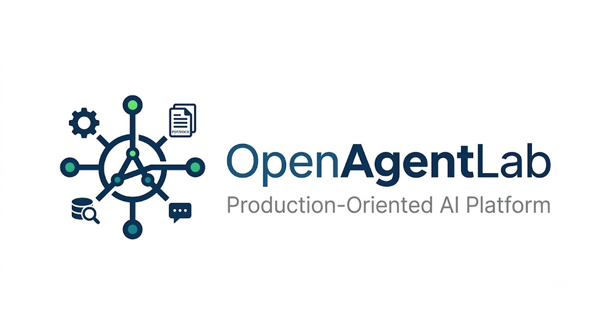

<div align="center">
  
</div>

# OpenAgentLab

> A production-oriented AI platform for document understanding, retrieval, and intelligent workflow orchestration.

OpenAgentLab is an open-source AI orchestration platform that demonstrates how to design, build, evaluate, and deploy modern AI applications using production-grade software engineering practices.

Rather than being a simple chatbot, OpenAgentLab is designed as an extensible platform where an AI Agent orchestrates deterministic tools to answer questions over structured and unstructured documents.

The project follows a **Design First** philosophy, with architecture and engineering decisions documented before implementation.

---

## Key Features

- Upload and persist supported files: PDF, CSV, XLSX, DOCX, TXT, and Markdown
- Deterministic document-processing tools for PDF, Excel, CSV, TXT, JSON, and DOCX
- Ask natural language questions over indexed document context
- RAG pipeline for loading, chunking, embedding, indexing, retrieval, and context construction
- LangGraph-based agent workflow components for planning, tool selection, execution, and response generation
- Workflow execution persistence and status lookup APIs
- Local storage plus PostgreSQL metadata persistence
- Qdrant vector search integration
- Optional Langfuse observability with redaction and LangChain/LangGraph callbacks
- Automated unit, integration, Docker, and AI evaluation workflows

---

# Architecture Overview

```
                  +----------------------+
                  |      REST API        |
                  |      FastAPI         |
                  +----------+-----------+
                             |
          +------------------+------------------+
          |                  |                  |
          v                  v                  v
   Document APIs      Question APIs      Workflow APIs
          |                  |                  |
          v                  v                  v
 Local Storage +      RAG Retrieval      PostgreSQL
 PostgreSQL Metadata  (OpenAI + Qdrant)  Workflow State
                             |
                  +----------+-----------+
                  | Context Builder      |
                  | + Source Metadata    |
                  +----------+-----------+
                             |
                             v
                  OpenAI Response Generation
```

Agent components provide LangGraph planning, tool selection, deterministic tool
execution, and response nodes for orchestrated workflows.

---

# Technology Stack

## MVP

The first version of OpenAgentLab is intentionally focused on a modern production AI stack.

| Category | Technology |
|-----------|------------|
| Backend | FastAPI |
| Workflow Engine | LangGraph |
| LLM | OpenAI |
| Tool Calling | OpenAI Tool Calling |
| Vector Database | Qdrant |
| Relational Database | PostgreSQL |
| Vector Extension | pgvector |
| Storage | Local Storage |
| Containerization | Docker |
| Local Orchestration | Docker Compose |
| Observability | Langfuse |
| AI Evaluation | DeepEval, Ragas |
| CI | GitHub Actions |
| Cloud | Microsoft Azure |

---

# Planned Evolution

The architecture has been designed to support additional production capabilities without major refactoring.

| Capability | Purpose |
|------------|---------|
| OpenTelemetry | Distributed tracing and metrics |
| Kubernetes | Container orchestration |
| Promptfoo | Prompt regression testing |
| MCP (Model Context Protocol) | Standardized AI tool integration |
| Azure DevOps *(optional)* | Enterprise CI/CD pipelines |
| Arize Phoenix *(optional)* | Advanced LLM observability and evaluation |

These technologies are intentionally planned for a later phase to keep the MVP focused while maintaining a clear evolution path.

---

# Repository Structure

```
OpenAgentLab/

├── src/
│   └── openagentlab/
│       ├── agent/
│       ├── api/
│       ├── core/
│       ├── database/
│       ├── evaluation/
│       ├── observability/
│       ├── rag/
│       ├── repositories/
│       ├── services/
│       ├── skills/
│       ├── storage/
│       └── tools/
├── tests/
│   ├── unit/
│   ├── integration/
│   ├── evaluation/
│   └── e2e/
├── docs/
│   ├── architecture/
│   ├── ADR/
│   └── engineering/
├── evaluation/
│   └── datasets/
├── alembic/
├── deployment/
├── docker/
├── storage/
├── .github/
│
├── Dockerfile
├── docker-compose.yml
├── pyproject.toml
└── README.md
```

---

# Backend Foundation

The FastAPI backend lives under `src/openagentlab`.

## Local setup

Install dependencies:

```bash
uv sync
```

Create local environment configuration when needed:

```bash
cp .env.example .env
```

Start the backend from the repository root:

```bash
uv run uvicorn openagentlab.main:app --reload --host 0.0.0.0 --port 8000
```

Official health endpoint:

```text
GET http://localhost:8000/api/v1/health
```

Current v1 API surface:

- `POST /api/v1/documents`: upload a supported document
- `GET /api/v1/documents`: list stored document metadata
- `POST /api/v1/questions`: ask a question, optionally scoped to document IDs
- `GET /api/v1/workflows/{workflow_id}`: inspect workflow execution status

Run tests:

```bash
uv run pytest
```

Run database migrations when using PostgreSQL-backed services:

```bash
uv run alembic upgrade head
```

## Local Docker Infrastructure

Create local configuration:

```bash
cp .env.example .env
```

Start the API, PostgreSQL, Qdrant, and Langfuse stack:

```bash
docker compose up -d --build
```

Useful local endpoints:

- OpenAgentLab API: `http://localhost:8000`
- OpenAgentLab health: `http://localhost:8000/api/v1/health`
- Qdrant API and dashboard: `http://localhost:6333`
- Qdrant gRPC: `localhost:6334`
- Langfuse: `http://localhost:3000`
- MinIO API for Langfuse blob storage: `http://localhost:9090`

Inspect and stop the stack:

```bash
docker compose ps
docker compose logs -f
docker compose down
```

`docker compose down` keeps named volumes. `docker compose down -v` removes the
local persistent data.

---

# Documentation

The project documentation is organized into three sections.

## Architecture

System design and technical specifications.

- Vision
- Personas
- User Stories
- Requirements
- Architecture
- API Design
- Database Design

## Architecture Decision Records (ADR)

Documents the reasoning behind architectural decisions.

Examples include:

- Why FastAPI?
- Why LangGraph?
- Why Qdrant?
- Why Docker?

## Engineering

Development practices and engineering principles.

- Design First
- Observability by Design
- Evaluation First

---

# Engineering Principles

OpenAgentLab follows several software engineering principles.

- Design First
- API First
- Evaluation First
- Observability by Design
- Clean Architecture
- SOLID Principles
- Separation of Concerns

---

# Project Roadmap

## Phase 1 — Architecture

- [x] Vision
- [x] Personas
- [x] User Stories
- [x] Requirements
- [x] Architecture
- [x] ADRs

---

## Phase 2 — Foundation

- [x] FastAPI
- [x] Docker
- [x] Docker Compose
- [x] PostgreSQL
- [x] Alembic
- [x] SQLAlchemy
- [x] GitHub Actions

---

## Phase 3 — Document Management

- [x] File Upload
- [x] Storage Layer
- [x] Metadata Management

---

## Phase 4 — AI Tools

- [x] PDF Reader
- [x] Excel Reader
- [x] CSV Reader
- [x] Text Reader
- [x] JSON Reader
- [x] DOCX Reader

---

## Phase 5 — RAG

- [x] Embedding Pipeline
- [x] Qdrant
- [x] Retrieval
- [x] Context Construction

---

## Phase 6 — Agent

- [x] LangGraph
- [x] Tool Calling
- [x] Workflow Engine

---

## Phase 7 — Observability

- [x] Langfuse integration
- [x] Structured Logging
- [x] Trace redaction and callback helpers
- [ ] Production dashboards and alerting

---

## Phase 8 — Evaluation

- [x] DeepEval
- [x] Ragas
- [x] GitHub Actions Integration
- [ ] Larger production-quality golden datasets

---

## Phase 9 — Cloud Deployment

- [ ] Azure
- [ ] Production Deployment

---

# Future Roadmap

After the MVP, OpenAgentLab will continue evolving toward a production-grade AI platform.

Future milestones include:

- Kubernetes deployment
- OpenTelemetry integration
- Promptfoo regression testing
- MCP support
- Azure DevOps pipelines
- Arize Phoenix integration
- Multi-agent workflows
- Authentication & authorization
- Streaming responses
- Plugin architecture

---

# Current Status

This project is under active development.

The design documentation and backend foundation are in place. The current
implementation includes document upload/list APIs, persisted file metadata,
workflow status APIs, deterministic reader tools, RAG infrastructure, LangGraph
agent components, optional Langfuse observability, and automated evaluation
infrastructure.

Remaining work is focused on production deployment, richer golden datasets,
authentication and authorization, streaming responses, user-facing clients, and
operational hardening.

---

# Contributing

Contributions, ideas, discussions, and feedback are welcome.

As the project evolves, contribution guidelines and development workflows will be published.

---

# License

This project is licensed under the GNU Affero General Public License v3.0 License.

---

# Acknowledgements

OpenAgentLab is inspired by modern AI Engineering practices and the open-source ecosystem, including:

- FastAPI
- LangGraph
- OpenAI
- Qdrant
- Langfuse
- PostgreSQL
- Docker
