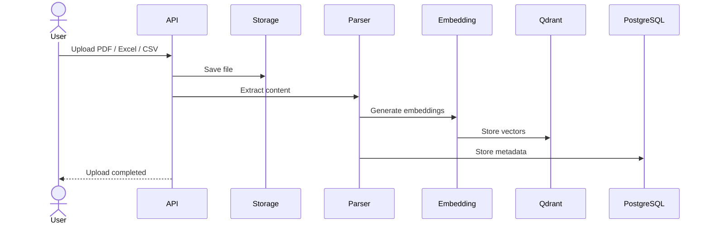
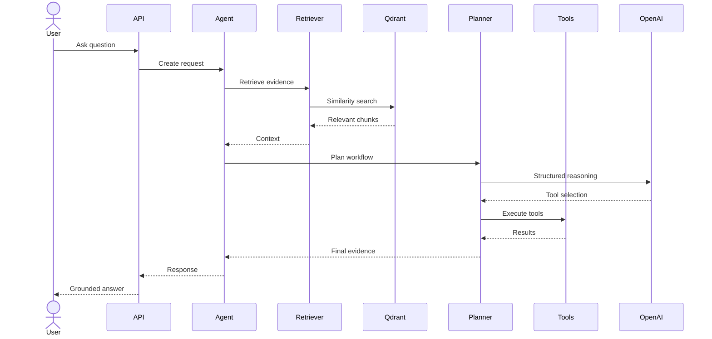
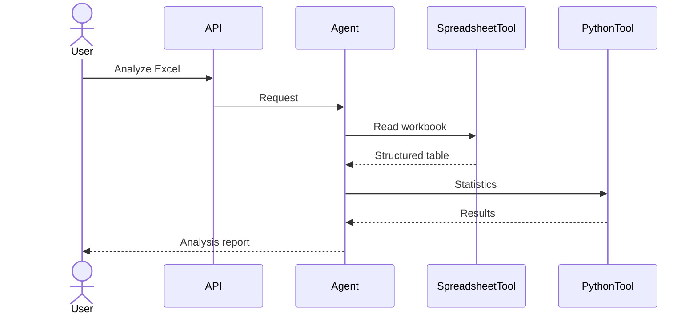
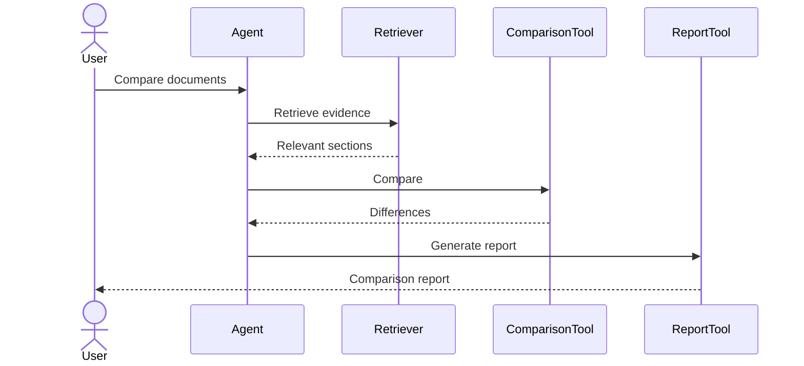
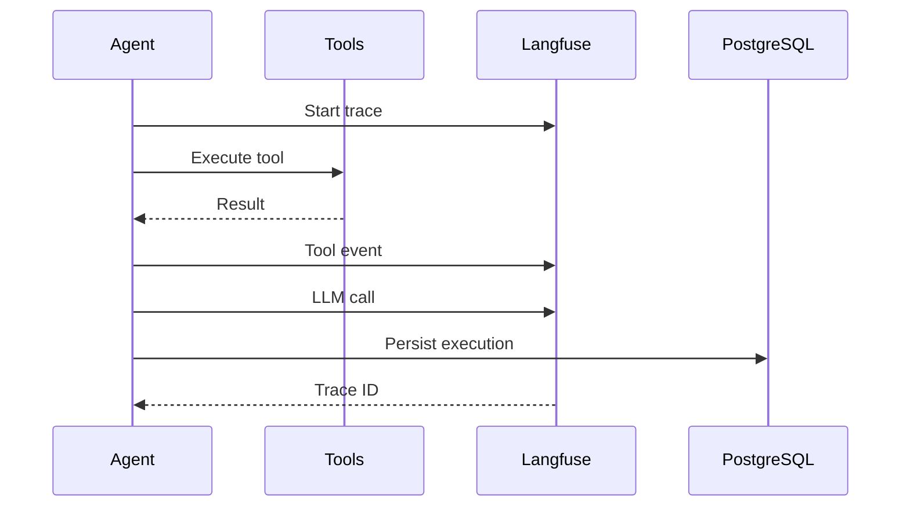
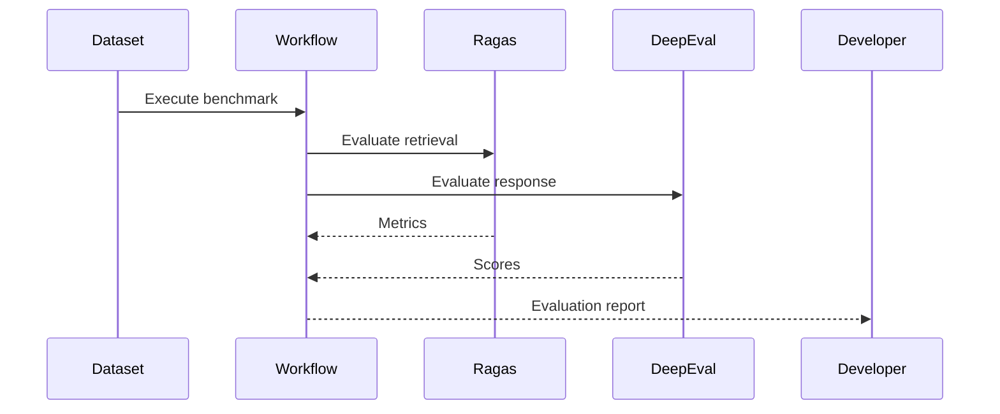

# Runtime Sequence Diagrams

> This document describes the runtime behavior of OpenAgentLab.
>
> While the High-Level Architecture defines the system structure, this document explains how the components collaborate during real user workflows.
>
> Sequence diagrams focus on interactions rather than implementation.

---

# Traceability

## Inputs

- 06-high-level-architecture.md

## Outputs

- 07-workflow-architecture.md

---

# Sequence Design Principles

All workflows follow these principles:

- LLMs coordinate execution.
- Deterministic tools perform computations.
- Retrieval occurs before answer generation.
- Every workflow is observable.
- Every important step is traceable.

---

# SD-001 — Upload and Index Documents

## Purpose

Prepare uploaded sources for future analytical workflows.

---

# SD-002 — Ask Analytical Question

## Purpose

Execute the standard AI workflow.

---

# SD-003 — Spreadsheet Analysis

## Purpose

Analyze structured datasets.

---

# SD-004 — Multi-Document Comparison

## Purpose

Compare heterogeneous information sources.

---

# SD-005 — Observability

## Purpose

Capture execution traces.

---

# SD-006 — Evaluation Pipeline

## Purpose

Evaluate system quality.

---

# Runtime Guarantees

Every production workflow should satisfy:

- deterministic tool execution
- retrieval before generation
- execution trace availability
- evidence visibility
- observable workflow
- reproducible evaluation