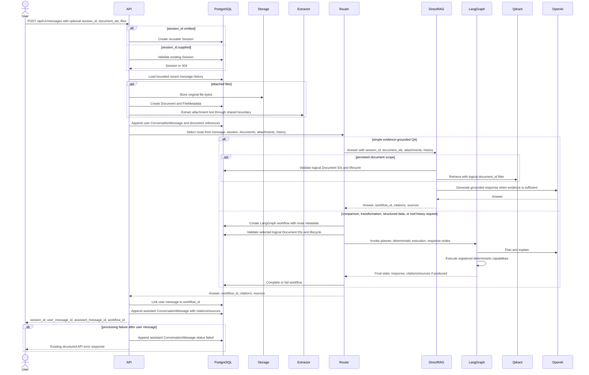
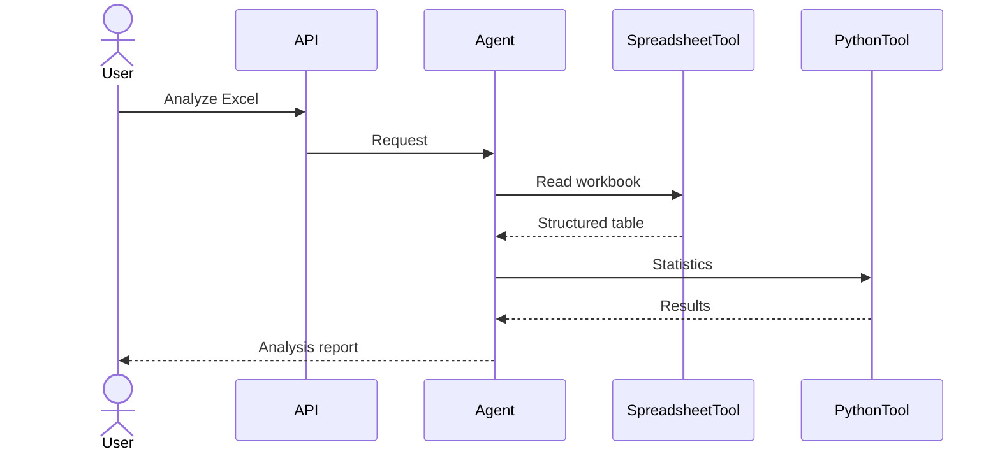
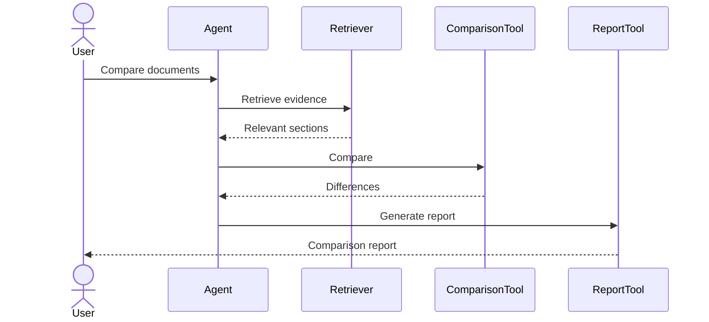
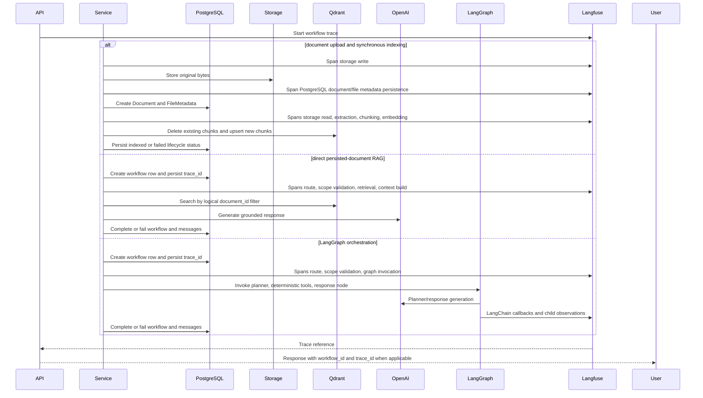
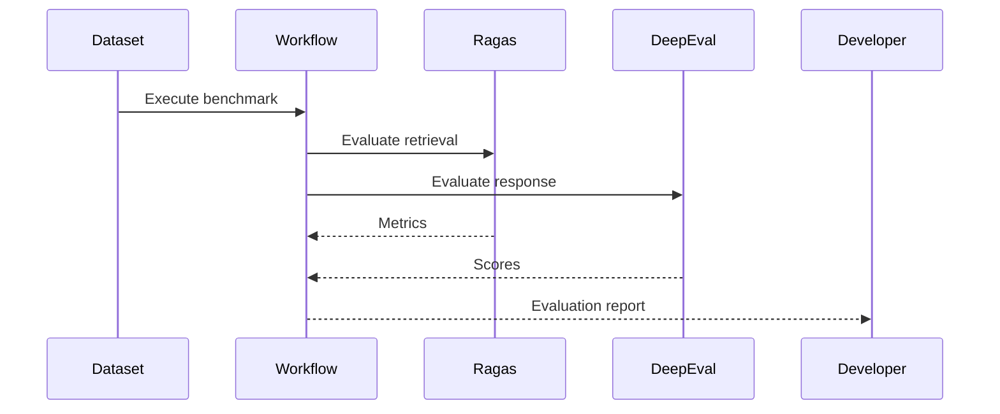

# Runtime Sequence Diagrams

> This document describes the runtime behavior of OpenAgentLab.
>
> While the High-Level Architecture defines the system structure, this document explains how the components collaborate during real user workflows.
>
> Sequence diagrams focus on interactions rather than implementation.

---

# Traceability

## Inputs

- 06-high-level-architecture.md

## Outputs

- 07-workflow-architecture.md

---

# Sequence Design Principles

All workflows follow these principles:

- LLMs coordinate execution.
- Deterministic tools perform computations.
- Retrieval occurs before answer generation.
- Every workflow is observable.
- Every important step is traceable.

---

# SD-001 — Upload and Index Document

## Purpose

Persist uploaded source files, create the logical document lifecycle state, and
synchronously index currently supported formats for retrieval.

```mermaid
sequenceDiagram

actor User

participant API

	participant Storage

	participant PostgreSQL

participant Extractor

	participant Chunker

	participant Embedding

	participant Qdrant

	User->>API: POST /api/v1/documents

	API->>Storage: Save file

	Storage-->>API: storage_key, size_bytes

	API->>API: Calculate checksum and lifecycle status uploaded

	API->>PostgreSQL: Create Session, Document, FileMetadata in one transaction

	PostgreSQL-->>API: document_id and file_metadata link

	API->>PostgreSQL: Set Document status processing

	API->>Storage: Read stored file by storage_key

	API->>Extractor: Extract deterministic source segments and metadata

	Extractor->>Chunker: Split text

	Chunker->>Embedding: Embed chunks

	API->>Qdrant: Delete existing chunks by logical document_id

	Embedding->>Qdrant: Upsert chunk vectors with logical document_id payload

	API->>PostgreSQL: Set Document status indexed or failed

	API-->>User: Upload response with final lifecycle status
	```

In this synchronous MVP, PDF, TXT, Markdown, CSV, JSON, DOCX, and XLSX all flow
through the shared extractor. Source-location metadata such as page numbers,
line ranges, row ranges, sheet names, paragraph indices, and JSON paths is
carried into chunks and Qdrant payloads. Indexing failure never deletes the
original file or metadata.

---

# SD-002 — Ask Analytical Question

## Purpose

Answer a question over explicitly selected logical documents using the direct
persisted-document RAG path.

```mermaid
sequenceDiagram

actor User

participant API

participant PostgreSQL

participant Retriever

participant Qdrant

participant Context

participant OpenAI

User->>API: POST /api/v1/questions with document_ids

API->>PostgreSQL: Validate logical document IDs and lifecycle state

alt any document missing
	PostgreSQL-->>API: Missing document
	API-->>User: 404 DOCUMENT_NOT_FOUND
else uploaded or processing
	PostgreSQL-->>API: Document not ready
	API-->>User: status not_ready, no Qdrant/model call
else failed
	PostgreSQL-->>API: Safe indexing failure code
	API-->>User: status indexing_failed, no Qdrant/model call
else indexed
	API->>Retriever: Retrieve with logical document_id filters

	Retriever->>Qdrant: Similarity search scoped by document_id

	Qdrant-->>Retriever: Matching chunks only

	Retriever->>Context: Deduplicate and enforce evidence budget

	alt no matching evidence
		Context-->>API: No source records
		API-->>User: status no_evidence, no model call
	else sufficient evidence
		Context-->>API: Bounded context and source records
		API->>OpenAI: Generate answer from retrieved evidence
		OpenAI-->>API: Answer
		API-->>User: status answered with structured citations
	end
end
```

Persisted-document QA does not invoke LangGraph in this phase. The direct RAG
path validates PostgreSQL lifecycle state first, never performs an unscoped
vector search, and returns citations built from retrieved chunk metadata.

---

# SD-003 — Persistent Multi-Turn Message

## Purpose

Create or continue a reusable conversation while keeping PostgreSQL as the
authoritative source of message history.



Conversation history is loaded from PostgreSQL using the configured turn and
character budgets. The router prefers the direct RAG path for simple factual or
summarization requests. It selects LangGraph only for explicit comparison,
cross-document synthesis, structured output, structured-data analysis, or
clarification/scope handling. Retrieved document chunks remain citations/sources
and are not copied wholesale into conversation history.

---

# SD-004 — Spreadsheet Analysis

## Purpose

Analyze structured datasets.



---

# SD-005 — Multi-Document Comparison

## Purpose

Compare heterogeneous information sources.



---

# SD-006 — Observability

## Purpose

Capture correlated, content-safe execution traces for real user workflows.



Telemetry is optional. When Langfuse is disabled or unavailable, the same runtime
paths use no-op observations. Telemetry payloads carry IDs, counts, route
choices, statuses, model names, and provider usage. They exclude raw file bytes,
extracted document text, full message history, local paths, storage keys,
credentials, and unbounded prompts. Observability failures do not fail user
workflows.

---

# SD-007 — Evaluation Pipeline

## Purpose

Evaluate system quality.



---

# Runtime Guarantees

Every production workflow should satisfy:

- deterministic tool execution
- retrieval before generation
- execution trace availability
- evidence visibility
- observable workflow
- reproducible evaluation
